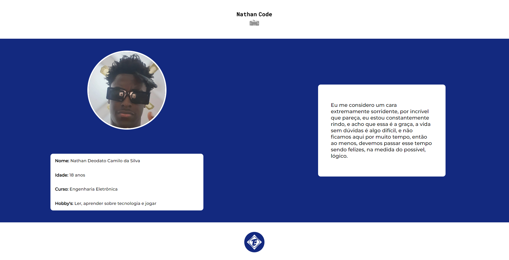

<h1> My Self - IEEE </h1>

    Este projeto tem o intuito de exercitar os conhecimentos e comandos de
    git e github adquiridos na capacitação trainee, além de exercitar também conhecimento de HTML(Hyper Text Markup Language) e consequentemente um pouco de CSS(Cascading Style Sheet).

---

<h5> Imagem do projeto </h5>

    

---

<h5> Design </h5>

---

<h5> Deploy </h5>

---

<h5> Tecnologias </h5>

    
    

----
<h5> Copyright </h5>

    
    

